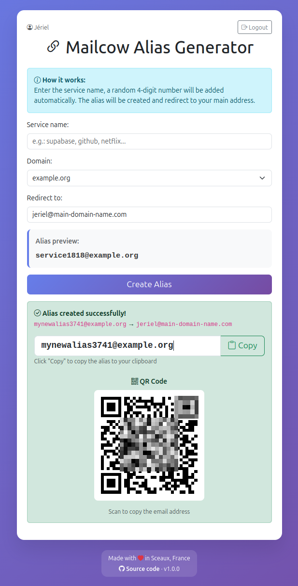
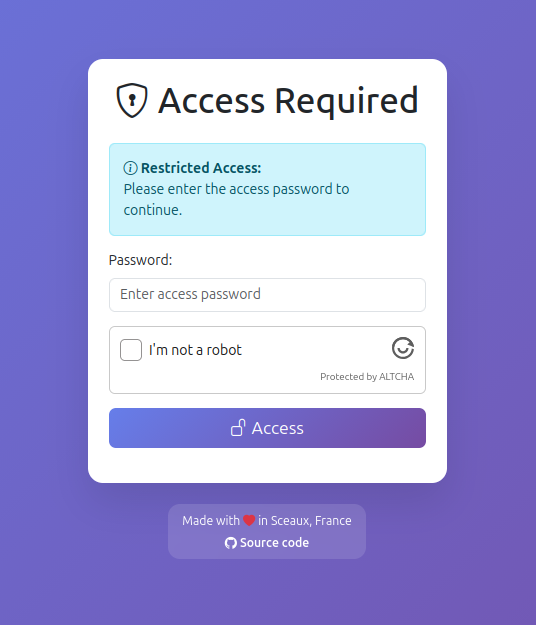

# 🔗 Mailcow Alias Generator

[](https://github.com/Upellift99/mailcow-alias-generator/actions/workflows/ci.yml)
[](https://github.com/Upellift99/mailcow-alias-generator/actions/workflows/docker-publish.yml)
[](LICENSE)
[](https://www.python.org/)
[](https://flask.palletsprojects.com/)
[](https://github.com/Upellift99/mailcow-alias-generator/releases)
[](https://github.com/Upellift99/mailcow-alias-generator/pkgs/container/mailcow-alias-generator)

A simple, self-hosted web tool to create email aliases via the [Mailcow](https://mailcow.email/) API. Perfect for giving every service its own throwaway alias (e.g. `supabase1234@example.com`) that redirects to your real inbox.

📦 **Repository**: [github.com/Upellift99/mailcow-alias-generator](https://github.com/Upellift99/mailcow-alias-generator)

## 📸 Screenshots

<table>
  <tr>
    <td align="center" valign="top">
      <br>
      <sub>Create an alias in one click (with QR code)</sub>
    </td>
    <td align="center" valign="top">
      <br>
      <sub>Password-protected login (optional ALTCHA captcha)</sub>
    </td>
  </tr>
</table>

## ✨ Features

- **One-click aliases** with an automatic random suffix and a live preview + QR code
- **Multiple domains** selectable from a dropdown
- **Multi-user**: each user has their own password and default redirect address
- **Secure login**: hashed passwords, login rate limiting, and an optional [ALTCHA](https://altcha.org/) captcha (privacy-friendly, GDPR-compliant)
- **Ready to deploy**: published Docker image + Docker Compose, responsive Bootstrap 5 UI
- **Simple JSON config** and a small REST API

## 🚀 Quick start (Docker)

The image is published to the GitHub Container Registry, so **you don't need to clone the repository** — just a `docker-compose.yml` and your `config.json` in an empty folder:

```bash
mkdir mailcow-alias-generator && cd mailcow-alias-generator

# Grab the compose file and a config template
curl -O https://raw.githubusercontent.com/Upellift99/mailcow-alias-generator/main/docker-compose.yml
curl -o config.json https://raw.githubusercontent.com/Upellift99/mailcow-alias-generator/main/config.sample.json

# Edit config.json (Mailcow URL, API key, domains, users — see Configuration)
docker compose up -d
```

The app is now available at `http://localhost:5000` (change the host port via `HOST_PORT` in a `.env` file).

```bash
docker compose ps          # status
docker compose logs -f     # logs
docker compose pull && docker compose up -d   # update to the latest image
```

> `docker-compose.yml` pulls `ghcr.io/upellift99/mailcow-alias-generator:latest` and mounts your `config.json` read-only — the image is self-contained, so that's all you need to run.

<details>
<summary>Build from source / run without Docker</summary>

Clone the repo if you want to build the image yourself or hack on the code:

```bash
git clone https://github.com/Upellift99/mailcow-alias-generator.git
cd mailcow-alias-generator
cp config.sample.json config.json   # then edit it
```

- **Build the image locally**: edit `docker-compose.yml` (swap `image:` for `build: .`) and run `docker compose up -d --build`.
- **Run with Python 3.9+**: `pip install -r requirements.txt && python app.py`.
</details>

## 🔧 Configuration

### 1. Get a Mailcow API key

In your Mailcow UI: **Configuration → API Access**, create a key with **read/write** on `alias` (and read on `domains` for validation). Put it in `config.json` as `api_key`.

### 2. Edit `config.json`

Minimal example:

```json
{
  "mailcow_url": "https://mail.example.com",
  "api_key": "YOUR_MAILCOW_API_KEY",
  "domains": ["example.com", "example2.com"],
  "default_domain": "example.com",
  "users": {
    "admin": {
      "password": "pbkdf2:sha256:...",
      "default_redirect": "admin@example.com",
      "description": "Administrator"
    }
  }
}
```

| Parameter | Description | Required |
|-----------|-------------|----------|
| `mailcow_url` | URL of your Mailcow instance | Yes |
| `api_key` | Your Mailcow API key | Yes |
| `domains` | List of domains available for aliases | Yes |
| `default_domain` | Domain pre-selected in the dropdown (defaults to the first one) | No |
| `users` | Multi-user object (see below) | Yes |
| `sogo_visible` | Make aliases visible in SOGo (default `true`) | No |
| `port` | Web interface port (default `5000`; forced to `5000` in Docker) | No |
| `altcha_enabled` | Enable the ALTCHA captcha (default `false`) | No |
| `altcha_provider` | `local` (default) or `gatecha` | No |
| `altcha_hmac_key` | HMAC key for the `local` provider | If local |
| `gatecha_url` / `gatecha_api_key` | GateCHA server URL and API key | If gatecha |

> The legacy single `"domain": "example.com"` format is still accepted and auto-converted to `domains`.

Each entry under `users` supports `password` (required), `default_redirect` (required) and `description` (optional). See the [Multi-User Setup guide](MULTI_USER_SETUP.md) for details.

### 3. Hash user passwords (recommended)

Don't store plaintext passwords. Generate a hash and paste it into the user's `password` field:

```bash
python generate_password_hash.py            # prompts for the password
python generate_password_hash.py "mypassword"
```

This prints a `pbkdf2:sha256:...` value. The app verifies hashes automatically (constant-time) and logs a warning at startup if it finds plaintext passwords. Plaintext still works for backward compatibility but is discouraged.

## 🛡️ ALTCHA captcha (optional)

[ALTCHA](https://altcha.org/) is a privacy-focused, GDPR-compliant captcha (no tracking, self-hosted verification). This project ships the **ALTCHA widget v3** and supports two providers via `altcha_provider`.

**`local`** — challenges generated and verified by this app:

```bash
head -c32 /dev/urandom | base64   # generate an HMAC key
```
```json
{ "altcha_enabled": true, "altcha_provider": "local", "altcha_hmac_key": "<the key>" }
```

**`gatecha`** — delegate to a self-hosted [GateCHA](https://gatecha.org/) server ([source](https://github.com/Upellift99/GateCHA)), handy to centralize captcha across several sites:

```json
{
  "altcha_enabled": true,
  "altcha_provider": "gatecha",
  "gatecha_url": "https://gatecha.example.com",
  "gatecha_api_key": "gk_your_api_key"
}
```

In `gatecha` mode the widget fetches its challenge from `GET {gatecha_url}/api/v1/challenge?apiKey=...` and this app verifies solutions via `POST {gatecha_url}/api/v1/verify?apiKey=...`; the local HMAC key is unused.

## 🎯 Usage

1. Open the app and log in with your user password (and solve the captcha if enabled).
2. Type a service name (e.g. `supabase`), pick a domain, check the redirect address.
3. Click **Create Alias** — you get something like `supabase1234@example.com`, with a copy button and QR code.

All mail to that alias now lands in your redirect inbox, and you know which service leaked your address.

### REST API

| Method | Endpoint | Description |
|--------|----------|-------------|
| `POST` | `/api/create-alias` | Create an alias (`{"alias": "...", "redirectTo": "..."}`) |
| `POST` | `/api/auth` | Authenticate (`{"password": "...", "altcha": "..."}`) — rate-limited |
| `GET` | `/api/config` | Public config (domains, version, captcha settings) |
| `GET` | `/api/status` | Health/connectivity to Mailcow |
| `GET` | `/api/altcha/challenge` | ALTCHA challenge (local provider) |

```bash
curl -X POST http://localhost:5000/api/create-alias \
  -H "Content-Type: application/json" \
  -d '{"alias": "github5678@example.com", "redirectTo": "you@example.com"}'
```

## 🔒 Security

- **Hashed passwords** (Werkzeug, constant-time) — see [hashing](#3-hash-user-passwords-recommended).
- **Login rate limiting**: `/api/auth` is capped (default **10/min, 50/hour per IP**); exceeding it returns HTTP 429. Counters are in memory by default — with several Gunicorn workers each keeps its own, so set `RATELIMIT_STORAGE_URI` (e.g. `redis://redis:6379`) for a strict shared limit.
- **Optional ALTCHA captcha** against automated abuse.
- **Read-only config mount** and a **non-root** container user (UID 1000).
- **Recommendations**: keep your API key secret, use strong (hashed) passwords, put it behind a reverse proxy with HTTPS, restrict network access, and keep the image updated (`docker compose pull`).

## 🧪 Tests & development

```bash
pip install -r requirements-dev.txt
pytest -q
```

The suite covers password verification, configuration, the API endpoints and rate limiting, and runs in CI on every push and pull request.

## 🐛 Troubleshooting

| Symptom | What to check |
|---------|---------------|
| *Invalid configuration* | `config.json` exists, is valid JSON, and is mounted into the container |
| *Unable to connect to Mailcow* | `mailcow_url` reachable from the container, Mailcow API enabled |
| *API authentication error* | `api_key` is correct and has `alias` read/write permission |
| *ALTCHA verification failed* | `altcha_enabled` is `true` and the provider is configured (HMAC key or GateCHA URL/key) |
| *Invalid password* | the password matches a `users` entry (and its hash, if hashed) |

```bash
docker compose logs -f mailcow-alias-generator   # follow logs
curl -f http://localhost:5000/api/status         # health check
```

## 📄 License

Licensed under the **GNU General Public License v3.0** — see [LICENSE](LICENSE). You may use, modify and redistribute it, but derivative works must also be GPL-3.0.
